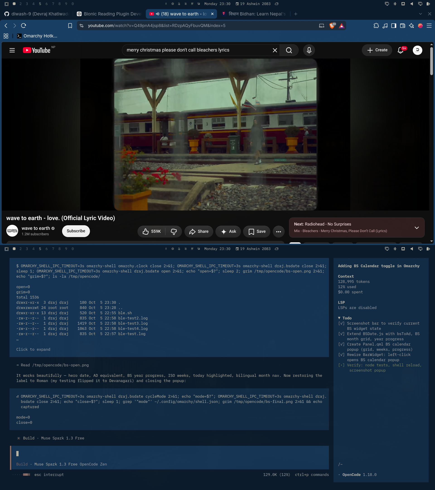
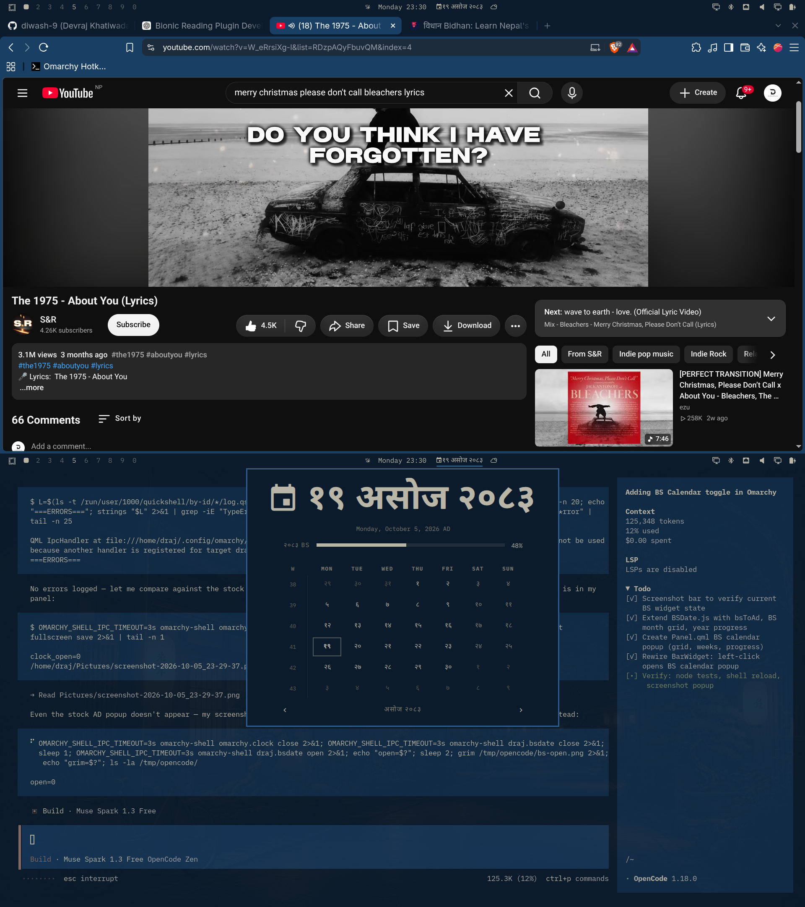

# omarchy-bsdate

Bikram Sambat (Nepali) date widget + full calendar popup for the [Omarchy](https://omarchy.org/) bar.

Omarchy's stock clock only knows the Gregorian calendar. This plugin puts the
Nepali date right beside it — English and Nepali dates side by side — and each
one opens its own calendar when clicked.




## Features

- **Bar label** shows today's BS date next to the AD clock (`19 Ashwin 2083`)
- **Left-click** opens a full BS calendar popup:
  - Hero with today's BS date + AD equivalent
  - BS year-progress rail
  - 6×7 month grid with ISO week numbers, today highlighted
  - Bilingual month label (`Ashwin • असोज २०८३`), month/year stepping
  - Hover any day to see its exact AD date
- **Right-click** toggles Roman ↔ Devanagari (`19 Ashwin 2083` ↔ `१९ असोज २०८३`)
- **Middle-click** opens a full Patro outside the bar (offline `npltz`/`nepcal` TUI if installed, else Hamro Patro in the browser)
- **100% offline** — calendar data is embedded, no network calls
- Follows stock clock conventions: `W` toggles Sunday/Monday week start, `t`
  jumps to today, arrow keys step months/years, `Esc` closes

## Requirements

- Omarchy (Hyprland on Arch) with the Quickshell-based shell
- Nothing else — no fonts, packages, or services to install

## Install

```bash
omarchy plugin add https://github.com/diwash-9/omarchy-bsdate --enable
omarchy plugin enable draj.bsdate --after omarchy.clock
```

Or run the bundled script (same thing, non-interactive):

```bash
./install.sh
```

Then restart the shell so the new code loads:

```bash
omarchy restart shell
```

> Note: `omarchy restart shell` may print `did not become ready after restart`
> — its readiness probe is impatient on slow startups. Confirm with
> `omarchy-shell shell ping` (expect `ok`).

Update later with:

```bash
omarchy plugin update draj.bsdate --yes
```

## Usage

| Action | Result |
|---|---|
| Left-click BS date | Open BS calendar popup |
| Right-click BS date | Toggle Roman / Devanagari label |
| Middle-click BS date | Full Patro (TUI or browser) |
| Inside popup: `←` `→` / `[` `]` | Previous / next BS month |
| Inside popup: `↑` `↓` / `{` `}` | Previous / next BS year |
| Inside popup: `t` | Back to today |
| Inside popup: `w` or click `W` | Toggle Sunday / Monday week start |

Terminal equivalents (also handy for keybindings):

```bash
omarchy-shell draj.bsdate open      # open the BS calendar
omarchy-shell draj.bsdate close     # close it
omarchy-shell draj.bsdate toggle    # toggle it
omarchy-shell draj.bsdate cycleMode # flip Roman/Devanagari label
omarchy-shell draj.bsdate refresh   # re-resolve today's date
```

## Uninstall

```bash
omarchy plugin disable draj.bsdate
omarchy plugin remove draj.bsdate
```

## Data & accuracy

- Month-length table: BS **2000–2100** (AD 1943–2043), from the community-verified
  [`@sonill/nepali-dates`](https://github.com/sonill/nepali-dates) dataset
  (`calendar-data.json`), sourced from the Nepal Panchanga Nirnayak Samiti
- Anchor: BS 2000-01-01 (Baisakh 1) = AD 1943-04-14
- Outside the supported range the widget shows `BS --` rather than a wrong date
- Week numbers use the same ISO-8601 definition as the stock AD clock

## Developing

Pure `BSDate.js` logic (conversion, grid, progress) is framework-free and
covered by dependency-free node tests:

```bash
node tests/test.js
```

Useful while hacking on the QML:

```bash
omarchy plugin validate ~/Projects/omarchy-bsdate
omarchy restart shell          # required: Quickshell's file-watcher is off in Omarchy
journalctl --user -t omarchy-shell --since "5 minutes ago"   # shell logs
```

To try changes live, either reinstall from your checkout or symlink it over
the installed plugin and restart the shell.

## License

MIT — see [LICENSE](LICENSE).
